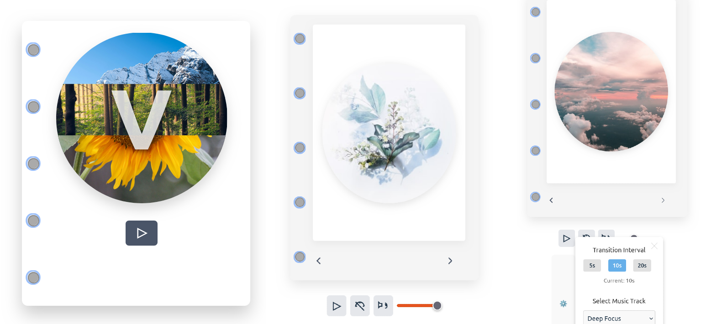

# Vibes App

Vibes is a meditation web application designed to enhance your mindfulness experience through beautiful nature visuals and calming background music. The app aims to create a serene environment for meditation, allowing users to customize their sessions to suit their preferences.



## Features

- **Nature Images**: Display a series of calming nature images to enhance the meditation experience.
- **Background Music**: Play soothing background music during meditation sessions.
- **Image Transition Timing**: Adjust the interval at which nature images change.
- **Music Track Selection**: Choose from different background music tracks.
- **Offline Mode**: Access cached content and use the app without an internet connection.
- **Session Preferences**: Save user preferences for music and image transitions.
- **Meditation History**: Track and view meditation session history.
- **Meditation Reminders**: Set daily or weekly reminders for meditation.

## Technologies Used

- **Frontend**: React, Vite, Tailwind CSS
- **Backend**: Ruby on Rails (existing backend)
- **Database**: PostgreSQL (for user preferences and history)
- **Caching**: Redis (for API response caching)
- **APIs**: Getty Images API for high-quality nature images

## Getting Started

### Prerequisites

- Node.js
- npm or yarn

### Installation

1. Clone the repository:

   ```bash
   git clone https://github.com/yourusername/vibes-app.git
   cd vibes-app
   ```

2. Install dependencies:

   ```bash
   npm install
   # or
   yarn install
   ```

3. Start the development server:

   ```bash
   npm run dev
   # or
   yarn dev
   ```

4. Open your browser and navigate to `http://localhost:3000`.

## Usage

- Navigate through the app to discover and customize your meditation experience.
- Use the settings to adjust image transition intervals and select your preferred music tracks.

## Contributing

Contributions are welcome! Please open an issue to discuss any improvements or features you'd like to propose.

## License

This project is licensed under the MIT License.

## Acknowledgments

- Inspiration for the Vibes app comes from the need for accessible meditation tools.
- Thanks to the contributors and the community for their support!
