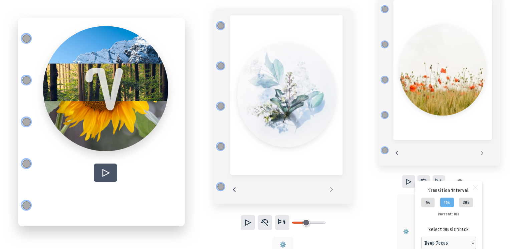

# Vibes App

Vibes is a meditation web application designed to enhance your mindfulness experience through beautiful nature visuals and calming background music. The app aims to create a serene environment for meditation, allowing users to customize their sessions to suit their preferences.



[Deployed site](https://vibes-sounds-app.netlify.app/)

## Features

- **Nature Images**: Display a series of calming nature images to enhance the meditation experience.
- **Background Music**: Play soothing background music during meditation sessions.
- **Image Transition Timing**: Adjust the interval at which nature images change.
- **Music Track Selection**: Choose from different background music tracks.
- **Offline Mode**: Access cached content and use the app without an internet connection.
- **Session Preferences**: Save user preferences for music and image transitions.
- **Meditation History**: Track and view meditation session history.
- **Meditation Reminders**: Set daily or weekly reminders for meditation.

## Technologies Used

- **Frontend**: React, Vite, Tailwind CSS
- **Backend**: Ruby on Rails (existing backend)
- **Database**: PostgreSQL (for user preferences and history)
- **Caching**: Redis (for API response caching)
- **APIs**: UnSplash Images API for high-quality nature images

## Getting Started

### Prerequisites

- Node.js
- npm or yarn

### Installation

1. Clone the repository:

   ```bash
   git clone https://github.com/yourusername/vibes-app.git
   cd vibes-app
   ```

2. Install dependencies:

   ```bash
   npm install
   # or
   yarn install
   ```

3. Start the development server:

   ```bash
   npm run dev
   # or
   yarn dev
   ```

4. Open your browser and navigate to `http://localhost:3000`.

## Usage

- Navigate through the app to discover and customize your meditation experience.
- Use the settings to adjust image transition intervals and select your preferred music tracks.

## Contributing

We welcome contributions! Please fork the repository and create a pull request with your changes.

- [User Stories](https://www.notion.so/User-Stories-Vibes-React-App-1abe6a4d98f280e3ac7cdf0bc4aafd65?pvs=4)
- [MVP User Stories](https://www.notion.so/MVP-User-Stories-Vibes-React-App-1abe6a4d98f2809ea876d98865c9c95f)

## License

This project is licensed under the MIT License.

## Acknowledgments

The meditation tracks in this application are sourced from:

- [The Cyber Hymnal](https://hymnary.org/hymnal/CYBER)
  - Christian hymns from many denominations and languages.
- [Free Music Archive](https://freemusicarchive.org/)

  - Collection of ambient and meditation music
  - License: Various Creative Commons licenses (CC BY, CC BY-SA)

- [Chosic](https://www.chosic.com/free-music/piano/)
  - Free piano background music downloads
- [UnSplash](https://unsplash.com/)
  - Free nature images and visuals
- [PicJumbo](https://picjumbo.com/)
  - Free nature images, backgrounds and photos
